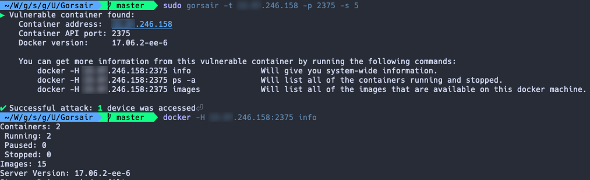
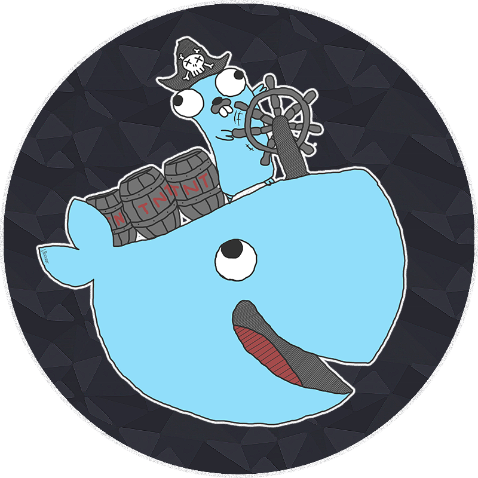

# Gorsair

Gorsair is a penetration testing tool for discovering and remotely accessing Docker APIs from vulnerable Docker containers.

Exposing the docker API on the internet is a tremendous risk, as it can let malicious agents get information on all of the other containers, images and system, as well as potentially getting privileged access to the whole system if the image uses the `root` user.

    
    

## Command line options

* **"-t, --targets"**: Set targets according to the [nmap target format](https://nmap.org/book/man-target-specification.html). Required. Example: `--targets="192.168.1.72,192.168.1.74"`
* **"-p, --ports"**: (Default: `2375,2376`) Set custom ports.
* **"-s, --speed"**: (Default: `4`) Set custom nmap discovery presets to improve speed or accuracy. It's recommended to lower it if you are attempting to scan an unstable and slow network, or to increase it if on a very performant and reliable network. You might also want to keep it low to keep your discovery stealthy. See [this for more info on the nmap timing templates](https://nmap.org/book/man-performance.html).
* **"-v, --verbose"**: Enable more verbose logs
* **"-h"** : Display the usage information

## How can I protect my containers from this attack

* Avoid putting containers that have access to the docker socket on the internet
* Avoid using the `root` account in docker containers
